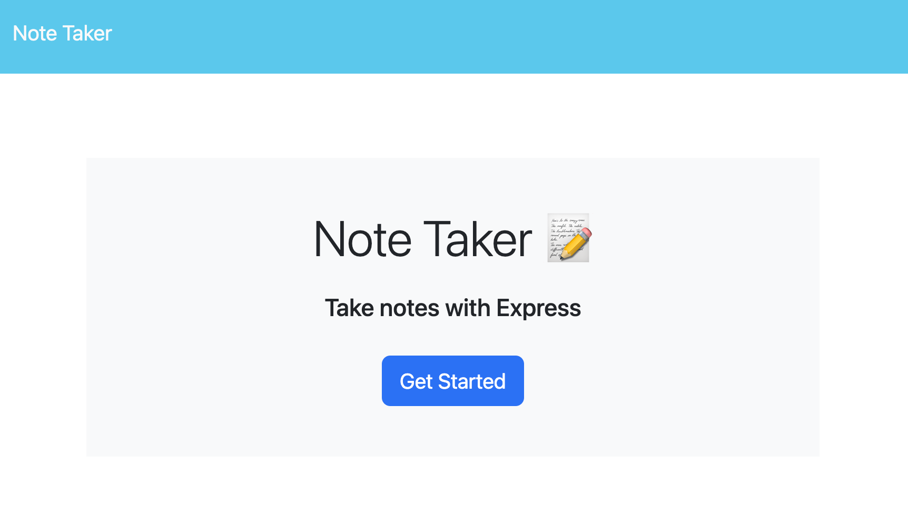
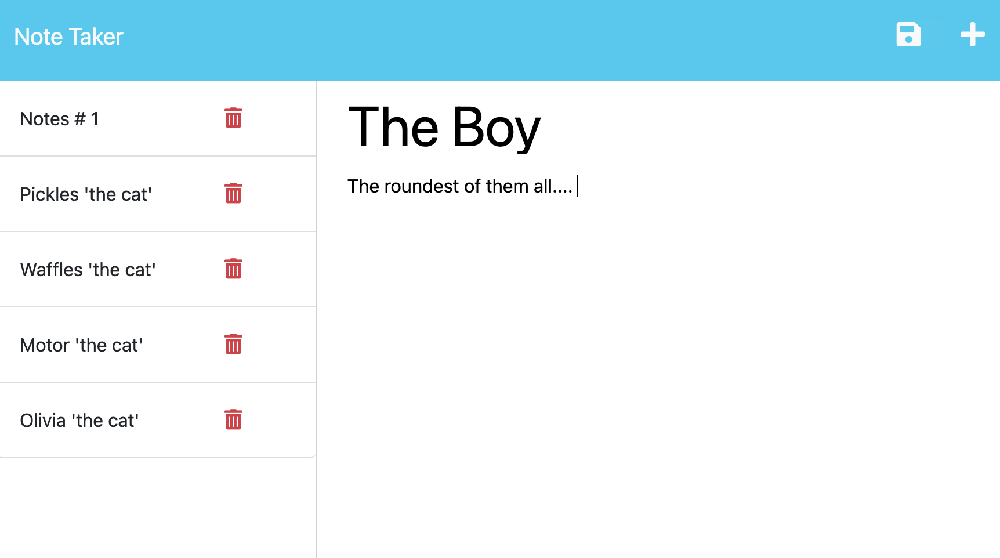
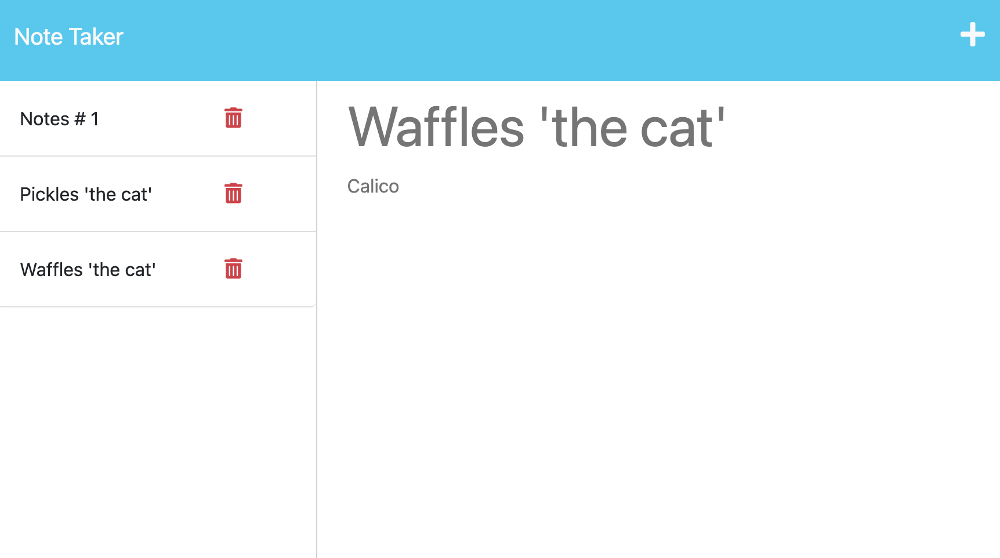

# Note-taking-app
### Jayné M. Valvere

```
IMPORTANT: 
* I was not able to deploy my application with HEROKU 
* As students, were supposed to recieve credits by connecting with our student profiles in GITHUB. 
* Unforuntatly I never signed up for the 'STUDENT STATUS' through GITHUB. 
* It is taking longer than anticipated to get verified as a student through HEROKU's website. 
* As soon as verification goes through, I will deploy the site and this repository.  
```

## Description : 
***Express.js*** <br>
This application will use **express.js** back end and will save and retrieve note data from a JSON file. 

## Table of Contents
* [User Story](#user-story)
* [Acceptace Criteria](#acceptance-criteria)
* [Screenshots](#screenshots)
* [Resources](#resources)
* [Questions](#questions)

## User Story : 
```
AS A small buisness owner 
I WANT to be able to write and save notes
SO THAT I can organize my thoughts and keep track of tasks I need to complete  
```

## Acceptance Criteria : 
```
GIVEN a note-taking applicaiton 
WHEN I open the NOTE TAKER
THEN I am presented with a landing page with link to a notes page
WHEN I click on the link to the notes page
THEN I am presented with a page with existing notes listed in the left-hand column, plus empty fields to enter a new note title and the note's text in the right-hand column 
WHEN I enter a new note title and the note's text 
THEN a Save icon appears in the navigation at the top of the page 
WHEN I click on the Save Icon 
THEN the new note I have entered is saved and appears in the left-hand column with the other existing notes
WHEN  I click on an existing note in the list in the left-hand column 
THEN that note appears in the right-hand column 
WHEN I clock on the WRite icon in the navigation at the top of the page
THEN I am presented with empty fields to enter a new note title and the note's text in the right-hand column 
```

## Screenshots : 

* landing page 


* First note being initiated 


* List of notes posted


* Same list of notes with some deletions 


## Resources :
* **Examples from class assignments**  : <br>
    * This week was a struggle. I started by using a lot of code from **Module-11**. I was able to sort of give my self  a 'map'' of 'TODO's' and started building from there. 
    * I used a few funcitons that didn't seem to work was was getting a lot of syntax erros because of it. 
    * I wasn't able to schedule time with my tutor but I ended up asking BCS lots of questions. I would open a ticket for one problem, they would help me solve, and then open other ticket to solve things like, console erros in my server, syntax errors, unecessary additions to code, eventlistern functions not working. 
    * In the end, ASK BCS was my biggest resource. 

* **ASK BCS** : <br>
when I was confused and running into console erros and deployment erros they were always there to check out my terrible syntax errors

* **[Youtube: FUNFUNFUNCTION](https://www.youtube.com/@funfunfunction)** : <br>
He has a lot of great video that have been breaking down concepts taht I have been feeling muddy on. 

## Questions :
Follow me on GitHub at [JayneValverde](https://github.com/JayneValverde) <br>
Contact me at Jaynevalverde@gmail.com <br>
Thank you!
