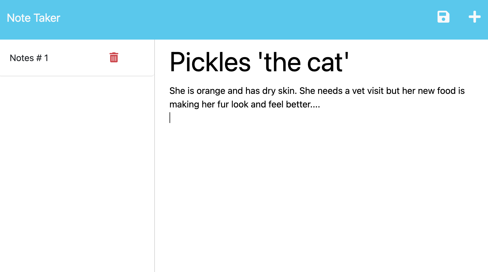
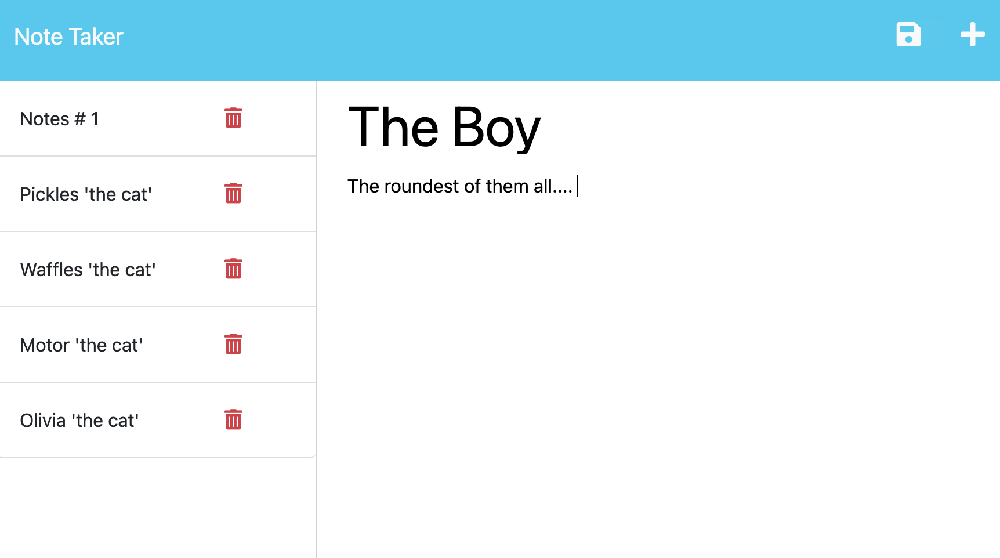
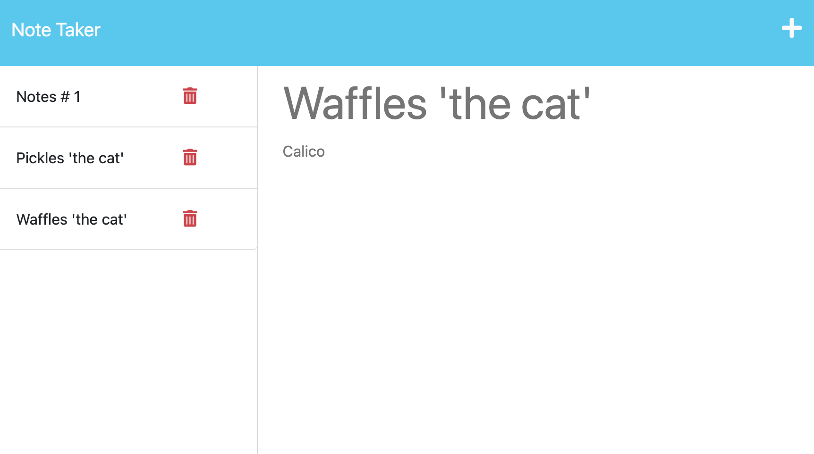

# Note-taking-app
### Jayné M. Valvere

## Description : 
***Express.js*** <br>
This application will use **express.js** back end and will save and retrieve note data from a JSON file. 


## Table of Contents
* [User Story](#user-story)
* [Acceptace Criteria](#acceptance-criteria)
* [Screenshots](#screenshots)
* [Resources](#resources)
* [Questions](#questions)


## User Story : 
```
AS A small buisness owner 
I WANT to be able to write and save notes
SO THAT I can organize my thoughts and keep track of tasks I need to complete  
```

## Acceptance Criteria : 
```
GIVEN a note-taking applicaiton 
WHEN I open the NOTE TAKER
THEN I am presented with a landing page with link to a notes page
WHEN I click on the link to the notes page
THEN I am presented with a page with existing notes listed in the left-hand column, plus empty fields to enter a new note title and the note's text in the right-hand column 
WHEN I enter a new note title and the note's text 
THEN a Save icon appears in the navigation at the top of the page 
WHEN I click on the Save Icon 
THEN the new note I have entered is saved and appears in the left-hand column with the other existing notes
WHEN  I click on an existing note in the list in the left-hand column 
THEN that note appears in the right-hand column 
WHEN I clock on the WRite icon in the navigation at the top of the page
THEN I am presented with empty fields to enter a new note title and the note's text in the right-hand column 
```

## Screenshots : 

* landing page 


* First note being initiated 


* List of notes posted


* Same list of notes with some deletions 


## Resources :
* **ASK BCS** : <br>
when I was confused and running into console erros and deployment erros they were always there to check out my terrible syntax errors

* **[Youtube: Async/await](https://www.youtube.com/watch?v=568g8hxJJp4)**

* **[Youtube: The Async Await Episode](https://www.youtube.com/watch?v=vn3tm0quoqE)**

* **Examples from class assignments**  : <br>
Did lots of extrapolating from Module-11 examples from that weeks lesson plan. 
A sort of frankenstien monster of code. 


## Questions :
Follow me on GitHub at [JayneValverde](https://github.com/JayneValverde) <br>
Contact me at Jaynevalverde@gmail.com <br>
Thank you!
